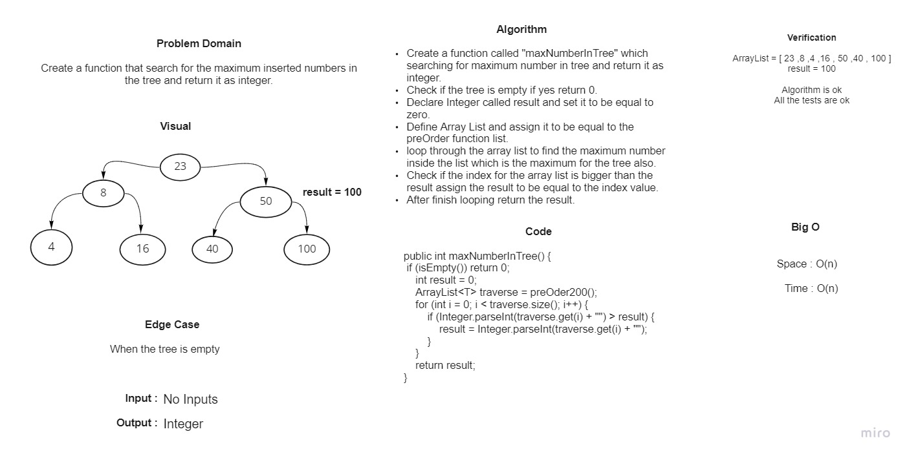

# Trees
<!-- Short summary or background information -->

Data structure which have three concept pre-order, in-order and post order.

## Challenge
<!-- Description of the challenge -->

- Get the maximum number in the tree.

## White Board

## Approach & Efficiency
<!-- What approach did you take? Why? What is the Big O space/time for this approach? -->

Big O for the binary search tree is O(n).

