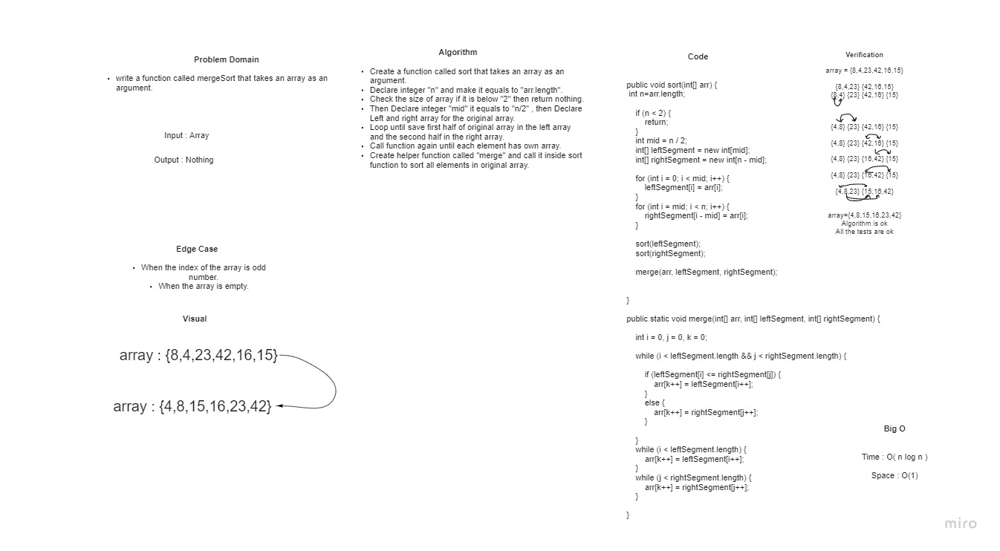

# Challenge Summary

insertion sort that will sort the array from the smallest to the biggest number in the array

## Whiteboard Process

## Approach & Efficiency
<!-- What approach did you take? Why? What is the Big O space/time for this approach? -->

I create a for loop to loop through the index of the array and a while loop to change
the indexes that bigger than the previous index.

BIG O :
space O(n log n)  because we created a for loop to loop through the array and a while loop 
to loop through the index of the array
time(1) constant .

