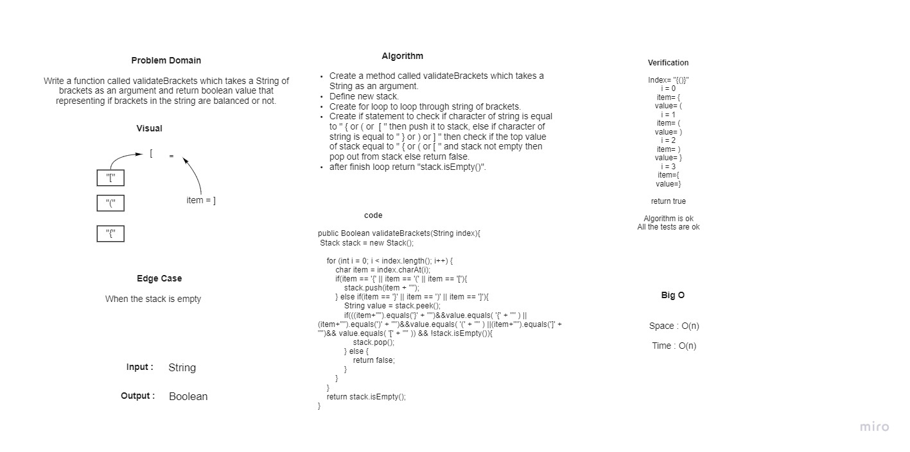

Challenge 12 Summary: 
Dog & Cat classes extends Animal class.
AnimalShelter Class holds only dogs and cats. 

The shelter operates using Queue. The 2Methods Inside AnimalShelter Class :
enqueue Arguments: animal, and animal can be either a dog or a cat object dequeue Arguments: pref, and pref can be
either "dog" or "cat". 
Return: either a dog or a cat, based on preference.
If pref is not "dog" or "cat" then return null. 

Approach & Efficiency 

Enqueue is O(1), by enqueue to Dog or Cat immediately.
Dequeue is O(1), by dequeue Dog or Cat immediately or return null.

WhiteBoard process:
