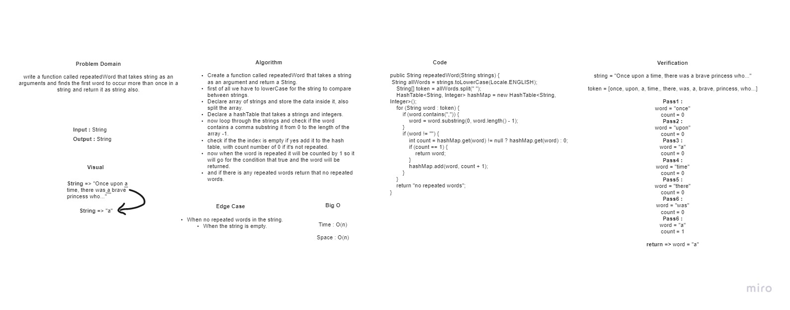

# HashTables

Data structure that store data using key/value pairs, By converting the string to numbers using the hashCode to store that key/value pairs.

## Challenge

Add a Strings to the hash table and check if this word is repeated or not.

## White board : 

