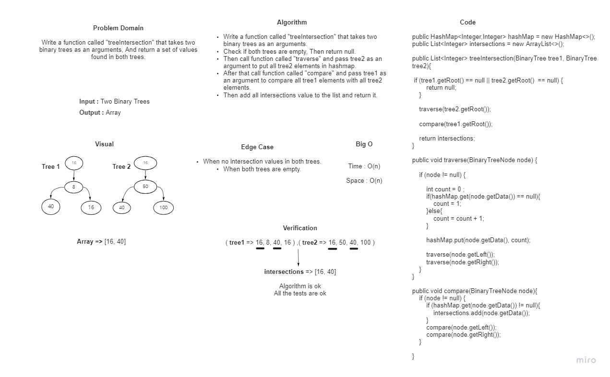

# HashTables

Data structure that store data using key/value pairs, By converting the string to numbers using the hashCode to store that key/value pairs.

## Challenge

Create a function that returns the relation data between two trees 

## White board : 

